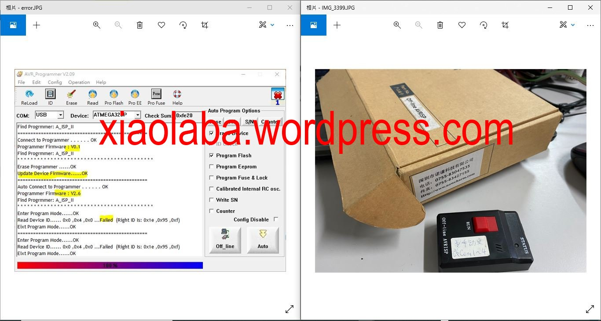
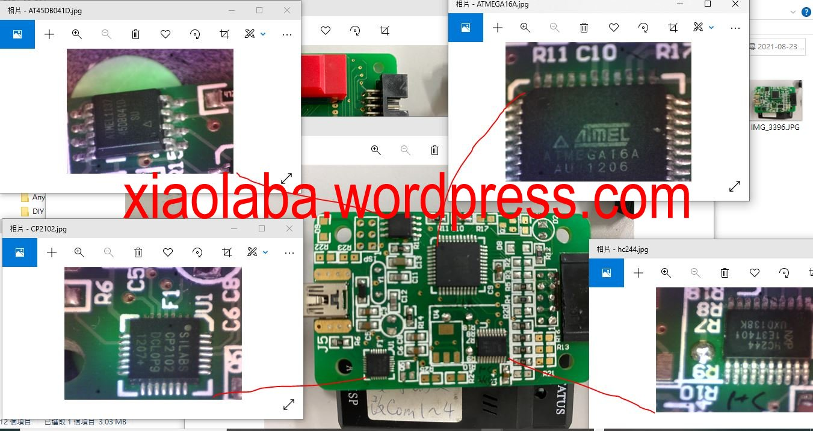
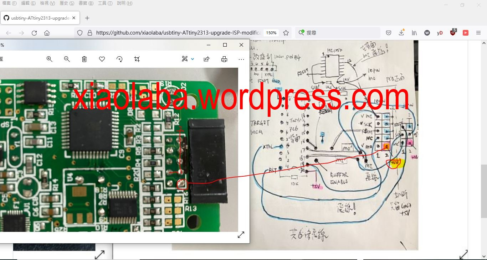

# Off-line-AVRISP
electronic scrap, it was failed and simply not be able to burn AVR chip, but why ?  

[U$60 at selling price](https://world.taobao.com/item/73238096.htm) but no more usable, the sales sheet telling website www.nowcharm.com was also obsolete, we can not connect to manufacturer website anymore.

Quick solution was replaced to be with trusted of my own design of [usbtiny](https://github.com/xiaolaba/usbtiny-ATtiny2313-upgrade-ISP-modification).  

this saying off-line AVR programmer was no longer working, does not matter power the target by external supply or this programmer. Return to selling was just simply not feasible as because the shipping cost and repairing bueget. So tearing down and to see why and how.  

### what was failed
USB ok, update firmeware ok, read chip ID and all other targeting fuctions failed.
  

### why it was fail
chips failed ?  
  

### the target MCU has no enough voltage supply, 2.3V ?
power the target MCU with stand alone 3.3V or 5V supply, no luck.  
  

